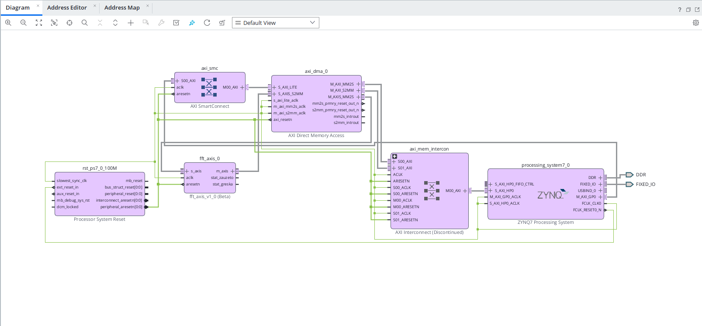
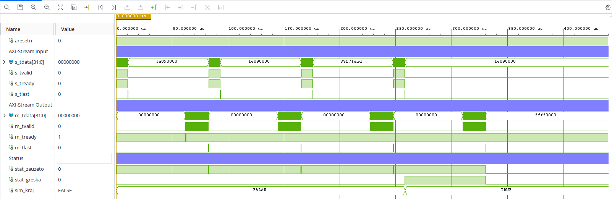

# FPGA FFT Accelerator (VHDL, Zynq-7000)

1024-point iterative radix-2 FFT accelerator written in VHDL for the Zynq-7000 SoC (Digilent Zybo Z7-20, XC7Z020). The accelerator is connected to the ARM Cortex-A9 through AXI DMA and AXI-Stream, and is driven by a bare-metal C program built in Vitis.

Bachelor thesis project, Faculty of Electronic Engineering, University of Niš.

| | |
|---|---|
| Transform length | 1024 points |
| Architecture | Iterative, single butterfly, radix-2 decimation-in-time |
| Number format | 16-bit signed fixed point (Q1.15), complex |
| Max. clock frequency | 201 MHz |
| Resources | 462 LUT, 274 FF, 3 BRAM tiles, 4 DSP48E1 (under 3% of the XC7Z020) |
| Speedup | 3.0x over a software implementation of the same algorithm in the same number format on the ARM Cortex-A9 (end-to-end, see [Performance](#performance)) |
| Interface | AXI DMA (simple mode) + AXI-Stream |

## Architecture

```
         AXI HP                 AXIS                    AXIS
ZYNQ7 PS ------> AXI DMA (MM2S) ------> fft_axis ------> AXI DMA (S2MM) ------> PS
                                          |
                                       fft_top
                       +------------------+------------------+
                       |                  |                  |
                 fft_kontroler       butterfly         twiddle_rom
                  (FSM, address     (complex mult.        (sin/cos
                   generation)       + add/sub)            table)
                       |
              2 x data_bram_tdp  (ping-pong buffers)
```



**How it works**

1. **Load.** Input samples arrive over AXI-Stream and are written into BRAM 0 in bit-reversed order, so the transform itself can run in place-like fashion without a separate reordering step.
2. **Compute.** The transform runs in log2(N) = 10 stages. In each stage the controller generates the address pair `(a, b)` and the twiddle-factor address for N/2 = 512 butterflies, one butterfly per clock cycle (5120 butterfly operations in total).
3. **Ping-pong buffering.** Two true dual-port BRAMs alternate roles. In every stage one is the *source* (read) and the other the *sink* (write); the roles swap at the end of each stage.
4. **Butterfly and scaling.** The butterfly uses four real 16x16-bit multipliers (these map to the 4 DSP48E1 blocks) for the complex twiddle multiplication, followed by an add/subtract. Products are truncated back to Q1.15 and each stage's output is divided by 2, so the result never overflows. The software model in `sw/fft_soft.c` uses the same truncation and scaling.
5. **Pipeline.** The datapath is pipelined (BRAM read + 4 butterfly stages: input register, multiply, accumulate, add/subtract; `PIPE_DUBINA = 5`). The controller delays write addresses and write-enable by the same depth, and waits for the pipeline to drain between stages.
6. **Read-out.** After the last stage the result is read from the last sink BRAM and streamed back over AXI-Stream.

The controller is a four-state FSM: `S_CEKA` (idle), `S_UPIS` (load), `S_RACUN` (compute), `S_KRAJ` (done).

## Repository structure

```
rtl/            VHDL sources (fft_top, fft_kontroler, butterfly, data_bram_tdp,
                twiddle_rom, twiddle_pkg, fft_axis)
sim/            Testbenches (fft_top_tb, fft_axis_tb)
constraints/    Zybo Z7 master XDC
hw/             Block design (Dizajn.bd) and exported hardware (.xsa)
sw/             Bare-metal C code for the ARM core (Vitis)
ip_repo/        fft_axis packaged as a Vivado user IP (used by the block design)
scripts/        Tcl scripts that recreate the Vivado project (recreate.tcl)
                and its block design (Dizajn_bd.tcl)
docs/           Diagrams and simulation waveforms
```

Naming note: identifiers and comments in the source code are in Serbian
(`kontroler` = controller, `upis` = write/load, `racun` = compute, `kraj` = end,
`obrada` = processing, `rezultat` = result).

## Verification

- **Simulation.** `sim/fft_top_tb.vhd` tests the core directly, `sim/fft_axis_tb.vhd` is a self-checking testbench for the AXI-Stream wrapper (7 tests, all passing):

  | # | Test | Check |
  |---|---|---|
  | 1 | Reset | Correct state after reset |
  | 2 | First packet, real sine at bin 5 | Input stream is deliberately interrupted after sample 20 |
  | 3 | Receiver stall during transfer | `TVALID` is held for 10 cycles while the receiver is not ready (AXI-Stream rule) |
  | 4 | Result of the first packet | Spectrum peak at bin 5, \|X\| = 8196 (expected ≈ 8192 for amplitude 0.5 with 1/N scaling) |
  | 5 | Second consecutive packet, same input | Result identical to the first, max. difference 0 LSB |
  | 6 | Complex input, exponential at bin 7 | Single peak, no conjugate image |
  | 7 | Error detection | Packet shorter than 1024 samples is reported through `stat_greska` |

- **On hardware.** `sw/fft_dma_test.c` generates a sine wave at bin 5 (amplitude 0.5), sends it through the accelerator and checks that the spectrum peak is at bin 5 (or its mirror, bin N-5).



*Simulation of the AXI-Stream wrapper at 100 MHz. Each transform loads 1024 samples (~10 µs), computes (~50 µs, `stat_zauzeto` high) and streams out the spectrum (~10 µs). The four packets shown correspond to tests 2, 5, 6 and 7; during the last one `stat_greska` goes high, as intended, because the packet is shorter than 1024 samples.*

## Performance

`fft_dma_test.c` measures the time of a complete hardware FFT call using the Cortex-A9 global timer. The measurement is **end-to-end**: it includes cache flush/invalidate, the DMA transfer in both directions and the FFT itself, not only the compute time inside the FPGA. The result is the mean of 100 consecutive runs (after one warm-up run). Min, max, mean and standard deviation are printed over UART.

`sw/fft_soft.c` contains three software implementations running on the ARM Cortex-A9, each timed over repeated runs:

| Variant | Description |
|---|---|
| `fft_q15()` | Iterative radix-2 FFT, Q1.15 fixed point, divide-by-2 scaling per stage. Same algorithm, number format and scaling as the hardware. **This is the baseline for the speedup figure.** |
| `fft_float()` | Same algorithm in double-precision floating point |
| `dft_direktna()` | Direct O(N²) DFT, reference for accuracy and a complexity upper bound |

The accelerator is **3.0x faster** than `fft_q15()`. Because the algorithm, number format and scaling are identical, the comparison isolates the effect of the hardware implementation. The program also prints the speedup over the floating-point FFT and the direct DFT.

Measurement caveat: the hardware time includes cache maintenance and the DMA transfer in both directions, while the software time covers only the FFT call itself (input unpacking is done outside the timed section). The hardware figure is therefore, if anything, pessimistic.

### FPGA resource utilization

FFT core, N = 1024, on the XC7Z020 (Zybo Z7-20):

| Resource | Used | Available | Utilization |
|---|---|---|---|
| Slice LUT | 462 | 53,200 | 0.87% |
| Slice Register | 274 | 106,400 | 0.26% |
| Block RAM Tile | 3 | 140 | 2.14% |
| DSP48E1 | 4 | 220 | 1.82% |

Maximum clock frequency: 201 MHz.

## Build and run

**Requirements:** Xilinx/AMD Vivado and Vitis 2025.2, a Digilent Zybo Z7-20 board.

1. Recreate the Vivado project:
   ```
   vivado -mode batch -source scripts/recreate.tcl
   ```
2. Run synthesis and implementation, generate the bitstream, then export the hardware (**File → Export → Export Hardware**).
3. In Vitis, create a platform from the exported `.xsa` and a standalone application. Add `sw/fft_dma_test.c` and `sw/fft_soft.c` to it.
4. Program the board and open a serial terminal (115200 baud) to see the results.

## License

MIT, see [LICENSE](LICENSE).
